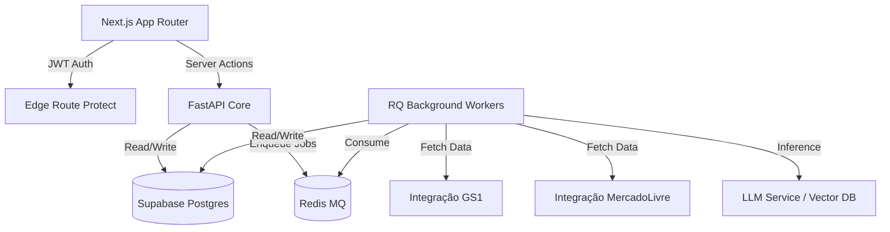

# Arquitetura do Sistema

A Plataforma Daludi Marketplace é um sistema state-of-the-art orientado a eventos e workflows determinísticos, utilizando um modelo hibridizado entre regras de negócio robustas e refinamento com Inteligência Artificial. 

## 1. Visão Geral da Topologia

O Monorepo está estruturado de forma desacoplada para facilitar o deploy independente de cada camada e escala assíncrona.

## 2. Camadas do Monorepo

### `apps/web/` (Next.js)
Frontend em **Next.js 15 (App Router)** usando `@supabase/ssr` para autenticação baseada em Cookies de servidor (Server-side rendering auth). As interfaces utilizam `Tailwind CSS 4` e `shadcn/ui` para UI limpa, escalável (dark mode nativo) e UX Premium de classe "Human-in-the-Loop". Responsável pelo roteamento protegido (`/dashboard`) e interceptação via Client Service (`/lib/api-client`) das chamadas ao FastAPI injetando o Header de `Authorization` dinâmico.

### `apps/api/` (FastAPI)
O orquestrador de API síncrona roda via `Uvicorn` empacotado pelos *middlewares* de isolamento multi-tenant (`TenantMiddleware`) e validação de claims de Auth. Toda a lógica exposta está organizada em View Functions simples. Ela interage com os módulos de _Shared_ para Data Validation e empurra workflows longos pro Worker injetando mensagens na MQ via Redis.

### `apps/worker/` (RQ + Python)
Motor de background. A espinha dorsal do projeto. É este módulo que interage diretamente e resolve a complexa "Fase 3: Pipeline GTIN". Utiliza de wrappers resilientes (`@with_retry` + `Jitter` e tratamento nativo de DLQs) para isolar a instabilidade da infraestrutura cloud do usuário (Mercado Livre/GS1 downs). Consome filas de importação, resolução, geração da copy usando o class `Pipeline`, e posterior disparo reverso publicando anúncios finalizados em `listing.publish`.

### `packages/shared/`
Contém os Pydantic Schemas que governam a fonte da verdade da tipagem entre a Web e a Interface, formatadores de log json estruturados (usado no Datadog e Kibana da Vercel) e dependências cruzadas.

## 3. Segurança e Banco de Dados (Supabase)

O Backend Data Layer baseia-se pesadamente em *PostgreSQL* hospedado no **Supabase**.
- **Multi-Tenancy Híbrido:** Todo registro obriga a constraint de `tenant_id`. Além disso, **Row Level Security (RLS)** empodera o isolamento de instâncias B2B impedindo acesso inter-cliente.
- **pgvector:** Extensão embutida nativamente nas migrations permitindo reúso inteligente `vectorreuse` de cópias (Copywriting) e descrições sem necessidade de reprocessamento em Batch pelo modelo LLM.

## 4. O "Mito" da IA - Pipeline Determinístico

Muitos Saas de IA sofrem com falta de assertividade sistêmica e custos abusivos de tokens. O Pipeline resolve isto enforçando a cadeia _`Rules → Templates → Cache → Vector Reuse → AI`_.

1. Valida Compliance via Regras cruas.
2. Formata via templates estáticos de Categoria (Eletrônicos/Casa/etc).
3. Busca se houve alteração apenas no Preço/Estoque.
4. Tenta achar semântica similar no DB (PgVector).
5. Se restou problemas ou for de fato algo "novo", passa pelo LLM.
